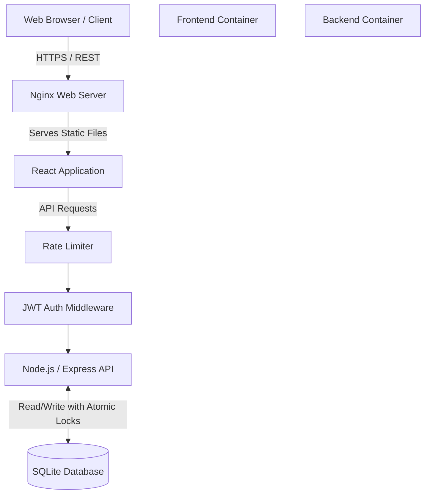
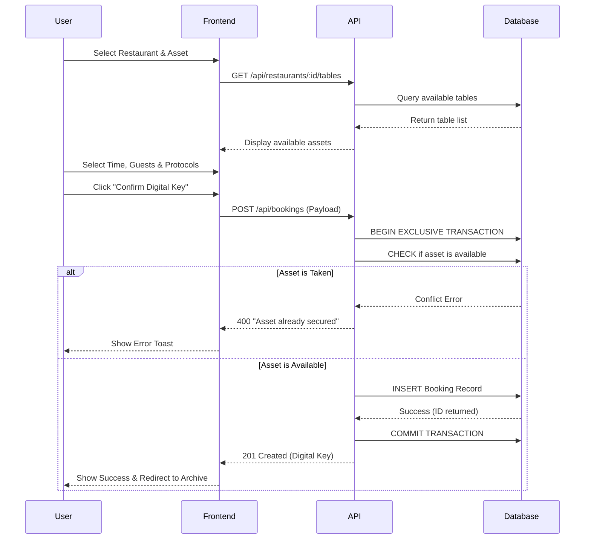

# Opus Dining - Premium Restaurant Reservation System

Opus Dining is a high-end, full-stack restaurant reservation platform designed for exclusive architectural dining experiences. It provides a robust, fail-proof booking engine with a sophisticated, luxury-focused user interface.

## 🌟 Key Features

- **Architectural Asset Selection:** Users don't just book a table; they reserve specific architectural assets (e.g., "The Obsidian Vault", "Rooftop Terrace") with detailed capacity and feature insights.
- **Luxury Protocols:** Integrated "Ghost Pay" (discreet pre-arrival settlement) and "Surprise Seating" (suppressed notifications) options.
- **Concurrency Protection:** Database-level atomic transactions and unique constraints ensure mathematically impossible double-bookings.
- **Resilient UI:** React frontend equipped with Axios interceptors for automatic request retries and global Error Boundaries to prevent crash states.
- **DDoS Protection:** Node.js backend fortified with IP-based rate limiting to prevent brute force and API flooding.
- **Dockerized Architecture:** Fully containerized with multi-stage builds for the frontend (Nginx) and backend (Node.js) for immediate cloud deployment.

---

## 🏗️ System Architecture



---

## 🔄 Booking Workflow



---

## 🚀 Getting Started (Local Development)

### Prerequisites
- Node.js (v18+)
- Docker & Docker Compose (Optional, for containerized run)

### Method 1: Docker (Recommended)
Launch the entire stack with a single command:
```bash
docker-compose up --build
```
- **Frontend:** http://localhost
- **Backend API:** http://localhost:5001

### Method 2: Manual Run

**1. Start the Backend:**
```bash
cd backend
npm install
npm start
```
*Runs on http://localhost:5001*

**2. Start the Frontend:**
```bash
cd frontend
npm install
npm start
```
*Runs on http://localhost:3000 (or 3002 depending on local port availability)*

---

## 🧪 Testing & Diagnostics

The project includes Python-based stress testing scripts to verify logical constraints and server load capacity.

**Prerequisites for testing:**
```bash
pip install requests
```

**1. System Diagnostic (Smoke Test):**
Verifies API connectivity, authentication, and database integrity.
```bash
python scripts/system_diagnostic.py
```

**2. Double-Booking Conflict Test:**
Fires 10 simultaneous requests at the exact same microsecond to prove the database constraint works.
```bash
python scripts/conflict_test.py
```

**3. Server Overload Test:**
Simulates 50 concurrent users browsing the site to verify Node.js throughput and Rate Limiting.
```bash
python scripts/load_test.py
```

---

## 📂 Directory Structure

```text
├── backend/                # Node.js/Express API
│   ├── database/           # SQLite Database files (.db)
│   ├── src/                
│   │   ├── config/         # DB & Environment configs
│   │   ├── controllers/    # Route logic (Auth, Bookings, etc.)
│   │   ├── middleware/     # JWT Auth, Error Handlers
│   │   ├── routes/         # Express API Routes
│   │   └── server.js       # App entry point
│   ├── apply_constraint.js # DB Migration script
│   └── Dockerfile          # Backend container spec
│
├── frontend/               # React SPA
│   ├── public/             # Static assets & local aesthetic images
│   ├── src/
│   │   ├── App.js          # Main Application & State Logic
│   │   ├── App.css         # Design System & Tailwind overrides
│   │   └── index.js        # React DOM render
│   └── Dockerfile          # Multi-stage Nginx container spec
│
├── scripts/                # Python testing & diagnostic suites
└── docker-compose.yml      # Orchestration configuration
```

---

## 🛡️ Security Posture

- **Password Hashing:** Passwords are mathematically salted and hashed via `bcryptjs` before entering the database.
- **Stateless Sessions:** User sessions are managed via short-lived JWT (JSON Web Tokens).
- **CORS Restricted:** API access is strictly limited to authorized frontend domains via environment variables.
- **SQL Injection Prevention:** Parameterized queries are used universally across all SQLite operations.

## 📄 License

This project is licensed under the MIT License.
